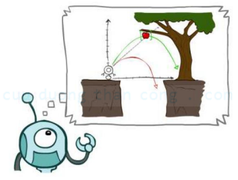
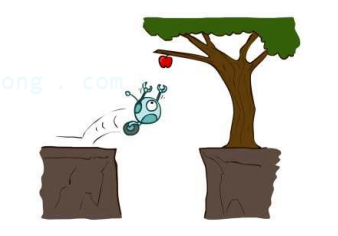
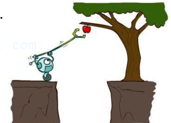
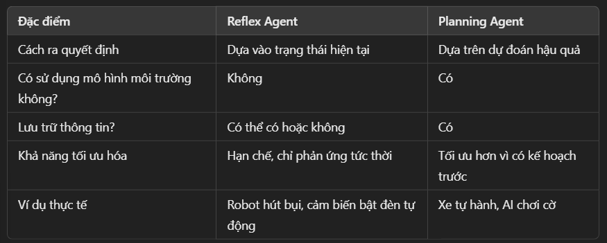

# Nhìn lại Agent
## Agent (Tác tử)
- Là một thực thể độc lập
    - Có khả năng *quan sát* môi trường (enviroment, world). Môi trường có thể là thế giới thực (Robot, xe tự hành) hoặc thế giới ảo (Phần mềm, AI ChatBot)

    - Có hành động tương ứng *nhằm đạt được mục tiêu*. Thông thường gồm 3 bước chính
        - Quan sát môi trường thông qua cảm biến và dữ liệu đầu vào

        - Ra quyết định dựa trên thuật toán hoặc quy tắc có sẵn

        - Thực hiện hành động để thay đổi hoặc phản hồi môi trường

- Ví dụ:
    - Một robot quét nhà có thể phát hiện bụi bẩn, và di chuyển để dọn dẹp

    - Google Maps dự đoán tuyến đường nhanh nhất dựa trên tình hình giao thông

    

## Reflex Agent (Tác tử phản xạ)
- Là loại tác tử:
    - Chỉ lựa chọn hành động dựa trên tri giác hiện tại (hoặc trí nhớ)

    - Biết được hoặc nhớ được trạng thái hiện tại của môi trường

    - Không nhắc đến hậu quả về sau khi lựa chọn hành động

- Tức là nó quan sát môi trường tại thời điểm đó và đưa ra hành động ngay lập tức mà không quan tâm đến hậu quả về sau

- Đặc điểm cơ bản:
    - Hoạt động theo quy tắc "cảm nhận và phản ứng" (Sense-Act).

    - Không có khả năng lên kế hoạch dài hạn.

    - Có thể sử dụng bộ nhớ để lưu trạng thái hiện tại của môi trường.

- Ví dụ:
    - Đèn giao thông thông mình
        - Nếu cảm biến phát hiện nhiều xe đang chờ đèn đỏ, nó đổi đèn xanh mà không tính toán xem điều đó có gây ra kẹt xe ở giao lộ khác không

    - Robot hút bụi
        - Nếu cảm biến phát hiện bụi, robot lập tức di chuyển đến đó để làm sạch mà không tính toán chiến lược tối ưu để quét toàn bộ căn phòng.
    
    

## Planning Agent
- Có khả năng lập kế hoạch trước khi hành động

- Luôn tự hỏi "Chuyện gì sẽ xảy ra nếu thực hiện hành động này"

- Ra quyết định dựa trên hậu quả để lại hành động

- Đặc điểm
    - Sử dụng mô hình mô phỏng để dự đoán kết quả hành động

    - Biết được cách thức/ mô hình mà môi trường phản hồi lại với các hành động

    - Lên kế hoạch để đạt được mục tiêu một cách hiệu quả

    - Cần hiểu rõ cách môi trường phản hồi lại với hanhd động

- Ví dụ:
    - Xe tự hành (Self-Driving Car): Khi đến ngã tư, xe không chỉ quan sát đèn hiện tại mà dự đoán hành vi của các phương tiện khác trước khi quyết định tăng tốc hay dừng lại

    - Game AI (cờ vua, cờ vây): AI không chỉ thực hiện nước đi dựa trên trạng thái hiện tại mà còn tính toán nhiều bước tiếp theo để dự đoán phản ứng của đối thủ và tìm ra nước đi tối ưu.

    

## So sánh Reflex Agent và Planning Agent

    

