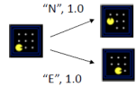

# Bài toán tìm kiếm
## Giới thiệu
- Một bài toán tìm kiếm gồm:
    - Không gian trạng thái `S`

        

    - Tập các hành động: `Actions(s)`

    - Trạng thái bắt đầu

    - Hàm kiểm tra trạng thái đích: `IsEnd(s)`

    - Hàm trạng thái kế tiếp (Successor Function)

        - Đi kèm hành động và chi phí
    
        

- Lời giải của bài toán tìm kiếm là một chuỗi các hành động (một kế hoạch) để chuyển từ trạng thái bắt đầu sang trạng thái đích