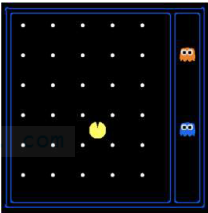

# Trạng thái và Không gian trạng thái
## Trạng thái (state)
- Trong bài toán tìm kiếm, trạng thái (state) là một biểu diễn của hệ thống hoặc môi trường tại một thời điểm nhất định. Có hai loại trạng thái quan trọng:

    - `Trạng thái của môi trường`: Chứa tất cả thông tin về môi trường, kể cả những chi tiết không cần thiết cho việc tìm kiếm.

        

    - `Trạng thái tìm kiếm` chỉ lưu giữ các chi tiết cần thiết cho việc lên kế hoạc hoặc ra quyết định

## Không gian trạng thái
- Tập tất cả các trạng thái tìm kiếm có thể có tạo thành không gian trạng thái

- Kích thước của không gian trạng thái:
    - Mỗi trạng thái gồm N chi tiết

    ```
    |S| = |D1| * |D2| * |D3| * ... * |Dn|
    ```

    - Mỗi chi tiết có miền giá trị Di

- Không gian trạng thái càng lớn thì độ phức tạp thuật toán càng cao

# Ví dụ: Trò chơi Pac-Man
Pac-Man là một bài toán tìm kiếm điển hình. Trong đó nhân vật Pac-Man phải di chuyển trong mê cung, ăn hết các dấu chấm và tránh các con ma.


## Trạng thái môi trường


- Vị trí của Agent (Pac-Man) (có 120 vị trí khác nhau trong mê cung).

- Các dấu chấm (có 30 dấu chấm).

- Vị trí của các con ma (mỗi con ma có thể ở 12 vị trí khác nhau).

- Hướng di chuyển của Pac-Man (có 4 hướng: Bắc (N), Nam (S), Đông (E), Tây (W)).

- Kích thước không gian trạng thái của môi trường:

    

    - Con số này rất lớn, vì nó bao gồm tất cả các trạng thái có thể xảy ra trong trò chơi.

## Trạng thái tìm kiếm
- Bài toán 1: Tìm đường đi từ vị trí hiện tại đến một vị trí khác
    - Trạng thái: `(x, y)`, chỉ lưu tọa độ hiện tại của Pac-Man.

    - Không gian trạng thái: 120 (số vị trí có thể có).

    - Hành động có thể thực hiện: N, S, E, W.

    - Hàm kiểm tra đích: IsEnd(x, y) kiểm tra xem Pac-Man đã đến vị trí mong muốn chưa.

    - Không gian trạng thái nhỏ hơn rất nhiều so với trạng thái môi trường.

- Bài toán 2: Ăn tất cả các dấu chấm
    - Trạng thái: (x, y, D), trong đó:

    - (x, y): vị trí hiện tại.

    - D: danh sách các dấu chấm chưa ăn (có 30 dấu chấm).

    - Không gian trạng thái: 120 * 2^{30} (mỗi dấu chấm có thể có trạng thái "có" hoặc "không").

    - Hành động có thể thực hiện: N, S, E, W.

    - Hàm kiểm tra đích: IsEnd(x, y, D) kiểm tra xem tất cả dấu chấm đã bị ăn chưa.
