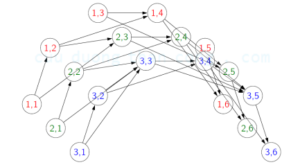

# Bài toán
- Tìm đường đi ngắn nhất từ thành phố 1 đến thành phố n, chỉ di chuyển tới

- Chi phí từ thành phố i đến j là c[i, j]

### Câu hỏi 1
- Không được viếng thăm quá 2 thành phố lẻ

- Trạng thái:
    - Thành phố trước là lẻ ?

    - Thành phố hiện tại ?

### Câu hỏi 2
- Cần viếng thăm ít nhất 3 thành phố lẻ

- Trạng thái:
    - min(Số thành phố lẻ đi qua, 3)

    - Thành phố hiện tại

### Câu hỏi 3
- Cần phải viếng thăm số thành phố lẻ nhiều hơn thành phố
chẵn.

- Tìm tập trạng thái nhỏ nhất?