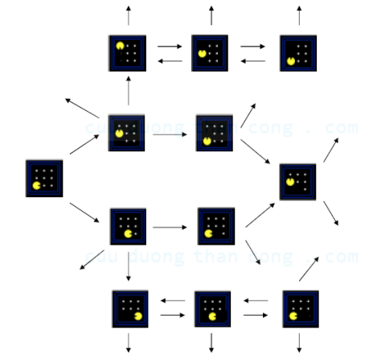
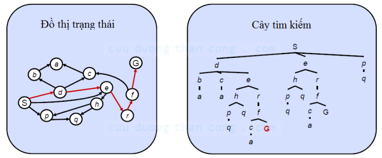
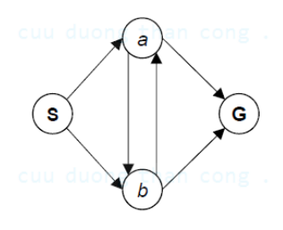
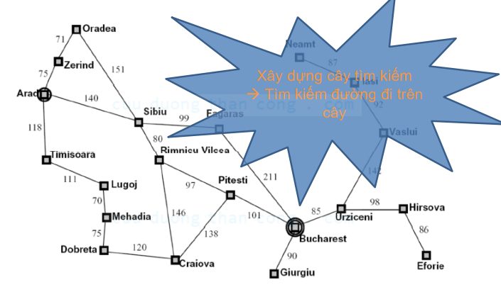

# Đồ thị trạng thái (State Graph)
## Khái niệm
- Là một cách biểu diễn hình học cho bài toán tìm kiếm

- Mỗi node tương ứng với một cấu hình của môi trường hay trạng thái

- Hàm kiểm tra trạng thái đích là tập các node đích (thường chỉ có một)

- Trong đồ thị trạng thái, mỗi trạng thái chỉ xuất hiện duy nhất một lần

- Thường chúng ta không xây dựng đầy đủ đồ thị trạng thái trên bộ nhớ vì rất lớn

# Cây tìm kiếm
## Khái niệm:
- Là một cây thể hiện các hành động và đầu ra/hậu quả tương ứng
    - Node gốc tương ứng với trạng thái bắt đầu
    
    - Các node con tương ứng với trạng thái kế tiếp của node cha.
    
    - Node lá tương ứng với trạng thái đích

    - Mỗi lời giải tương ứng với một đường đi từ gốc đến node lá

- Mỗi trạng thái có thể xuất hiện nhiều hơn 1 lần.

- Thường không xây dựng đầy đủ cây tìm kiếm trong bộ nhớ vì rất lớn

# State Graph và Search Tree

# Câu hỏi
- Có bao nhiêu node trên cây tìm kiếm tương ứng với đồ thị
trạng thái sau?

- Tìm đường đi với bản đồ Romania

